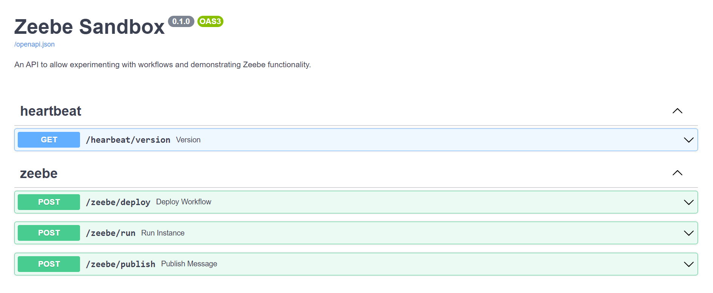
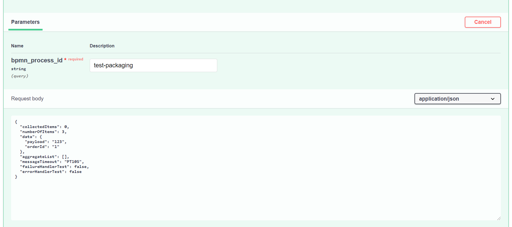
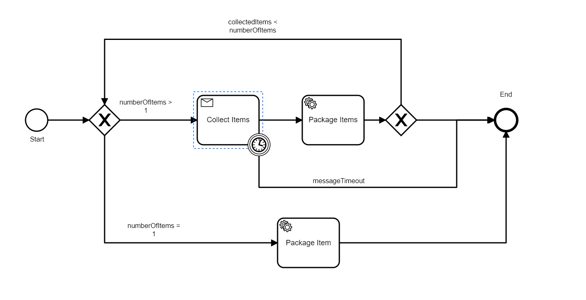
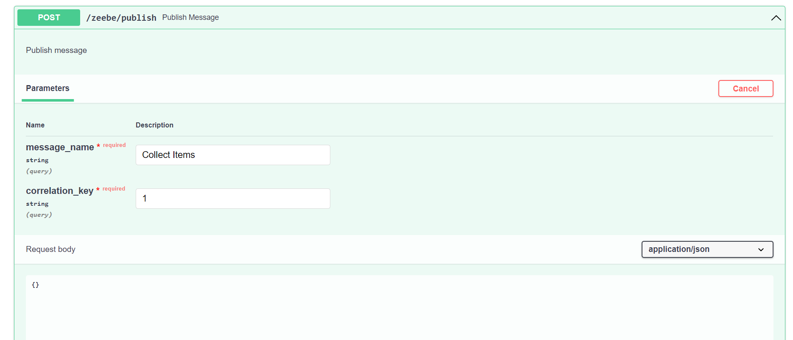
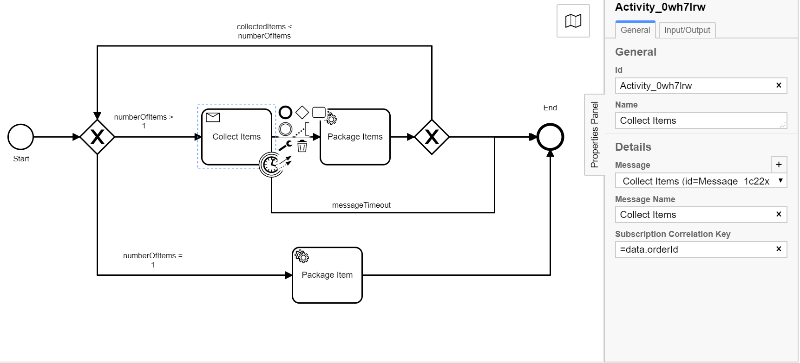
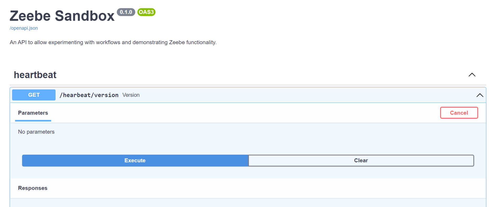
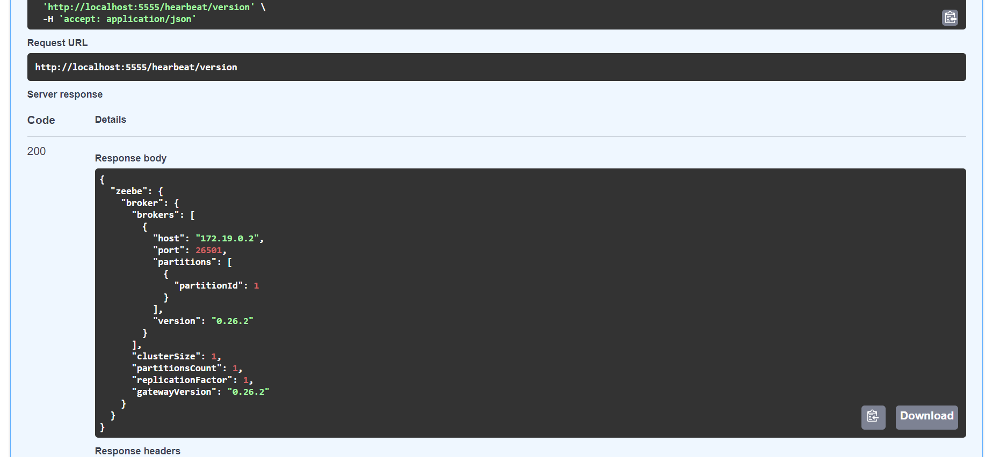

<h1 align="center">
   <strong>python-zeebe</strong>
</h1>

<p align="center">
    <a href="https://github.com/nimanamjouyan/python-zeebe/blob/main/LICENSE" target="_blank">
        
    </a>
    <a href="https://github.com/psf/black" target="_blank">
        
    </a>
</p>


A FastAPI python sandbox for Zeebe to deploy workflows, run instances and publish messages. This dockerised app runs Zeebe Simple Monitor, a single node Zeebe broker and a FastAPI python container to allow exploration/investigation of Zeebe features and workflows.


## Main Features

- Deploy Zeebe workflows from .bpmn files.
- Run workflow instances.
- Publish messages.
- Displaying features in Zeebe such as:
  - Message aggregation.
  - Dynamic timers using expression language.
  - Distinction between "errors" and "failures" in Zeebe workflows and how to handle them in task exception handlers.
- Integration with FastAPI.

## Usage

Use docker compose to get the containers up:

```bash
docker-compose up
```

*Note:*

- Since it takes a little time for the Zeebe broker to come online, it is ok to see the zeebe-runner container coming up and retrying. It will eventually connect to the broker and stay up.
- If one makes any changes to the zeebe-runner python code, currently, it is needed to stop and start again for the service to resume running again.

Navigate to [http://localhost:5555](http://localhost:5555) and check out zeebe-runner endpoint:



Also you can navigate to [http://localhost:808](http://localhost:8082) to access Zeebe Simple Monitor.


### Deploying a workflow

Select a .bpmn file containing the desired workflow by browsing for it. In this case the ```collect-items.bpmn```. Then click on Execute.


On Zeebe Simple Monitor, the deployed workflow can be seen.


### Running an instance of the deployed workflow

In the case of ```collect-items.bpmn``` the ```bpmn_process_id``` is ```test-packaging```.The dictionary in the response area contains default values of necessary variables used in the workflow and utilised by tasks.



 It helps to take a look at the workflow and the annotations on the arrows/paths for these variables to make sense:



```collectedItems```: This variable is used to keep track of items during aggregation loop and is only used during the aggregation process. If variable ```"numberOfItems``` is bigger than 1, the flow will go through the ```Collect Items``` and ```Package Items``` taks and loop there (aggregate in a list). For every completed loop, the value of ```collectedItems``` is incremented, until the condition at the next gate for moving to the end is satisfied.

```"numberOfItems```: A number of items are expected to arrive at the ```Collect Items``` task and correlate with the ```orderId``` that initially opened a message correlation event. By default, this variable is set to 3, which means 3 messages need to be published so that the aggregation loop is completed 3 times and the condition at the last gate for moving to the end is met.

```data```: It is made-up data, which contains the field of interest (i.e. ```orderId```) that is used for message correlation.

```aggregateList```: An empty list used for aggregating data.

```messageTimeout```: Using expression language, one can pass variable time durations, in the correct format to configure the time-out duration for message correlation. The concept behind this time-out is so the flow does not get stuck at the ```Collect Items``` task if the messages never arrive or get correlated.

```failureHandlerTest```: If set to true, allows one to simulate a failure condition only in the ```Package Item``` task. This means ```numberOfItems``` must be set to 1.

```errorHandlerTest```: If set to true, allows one to simulate an error condition only in the ```Package Item``` task. This means ```numberOfItems``` must be set to 1.

### Publish messages

To publish messages, the message name and the correlation key are needed. Furthermore, in the Request Body field a dictionary of variables can be added to be published with message:



These parameters have been set previously. In this case using Zeebe Modeller:



### Hearbeat

Allows getting info on the Zeebe broker, when it is up and running:



